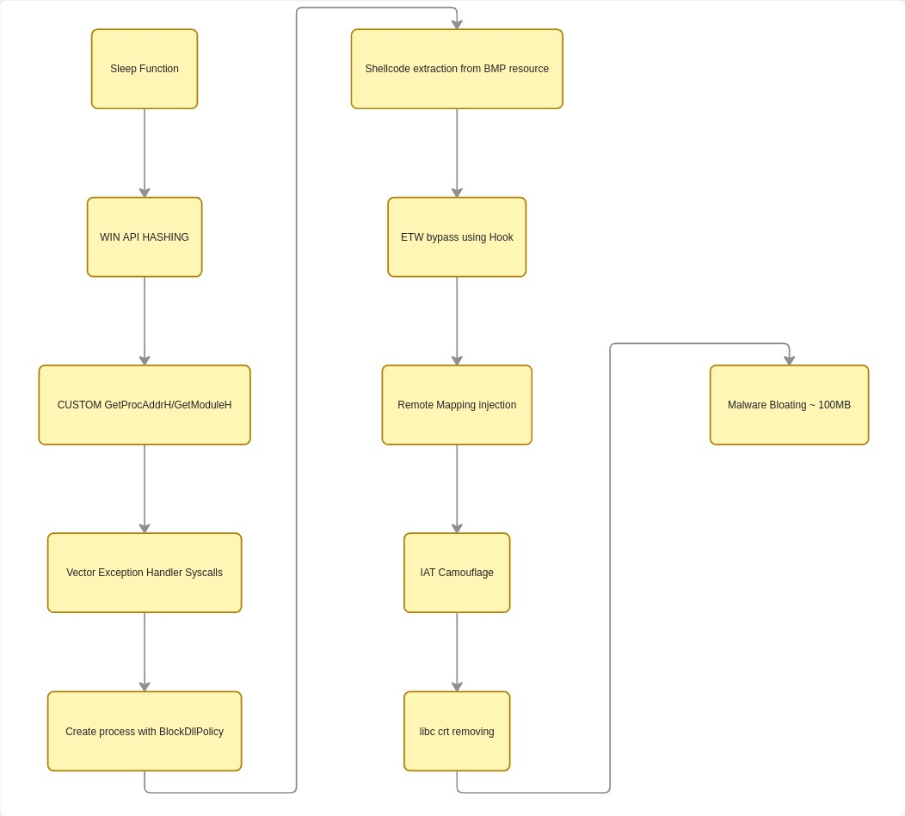
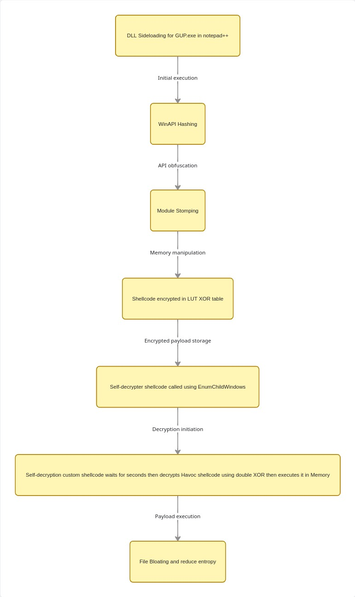

# 🔴 AV-EDR-Evasion-List

A repository that includes PoC and techniques to evade various security solutions such as Antivirus and EDR systems.

> **Adversary Simulation | Malware Development | AV/EDR Evasion Research**

---

## 📑 Repository Index

* [🧭 Overview](#-overview)
* [🎯 Objectives](#-objectives)
* [🧠 Malware Types & Techniques](#-malware-types--techniques)
    * [🧬 1. Shellcode Injector (t_f_shell.exe)](#-1-shellcode-injector-t_f_shellexe)
    * [📦 2. Trojanized DLL (libcurl.dll)](#-2-trojanized-dll-side-loaded-payload--libcurldll)
    * [🧪 3. WER Native PoC (LSASS Dump & PPL Bypass)](#-3-wer-based-credential-access-research--wer-native-poc-to-bypass-ppl-and-dump-lsass)
* [🛡️ AV / EDR Evaluation Results](#-av--edr-evaluation-results)
* [🎥 Proof of Concept (PoC)](#-proof-of-concept-poc)
* [⚠️ Disclaimer](#-disclaimer)
* [🧩 Future Work](#-future-work)

---

## 🧭 Overview

This repository presents a **practical adversary simulation project** focused on evaluating and bypassing modern **Antivirus (AV) and Endpoint Detection & Response (EDR)** solutions.

The project replicates real-world offensive techniques used by advanced threat actors.

---

## 🎯 Objectives

* Simulate **real-world malware behavior**
* Evaluate detection capabilities across multiple AV engines and EDRs
* Implement and test **evasion techniques used in red teaming**
* Provide a **hands-on reference** for security researchers and defenders

---

## 🧠 Malware Types & Techniques

This project uses **distinct malware delivery types**, each designed to bypass specific detection mechanisms.

---

### 🧬 1. Shellcode Injector `t_f_shell.exe`

**Malware Type:**
➡️ **Fileless Loader / In-Memory Injector**

**Technique Used:**
➡️ Remote Process Injection (Shellcode Execution)

**Behavior:**

* Injects shellcode into a legitimate **remote process**
* Executes payload fully **in memory**
* No malicious file written to disk

**Why it bypasses AV:**

* Avoids signature-based detection 
* Evades static analysis engines
* Mimics real-world malware loaders

---

### 📦 2. Trojanized DLL (Side-Loaded Payload) — `libcurl.dll`

**Malware Type:**
➡️ **Trojanized DLL / Side-Loaded Payload**

**Technique Used:**
➡️ DLL Side Loading

**Behavior:**

* Malicious DLL placed next to a trusted executable
* Loaded automatically by the application
* Executes under **trusted process context**

**Why it bypasses AV:**

* Trusted application masks malicious execution
* Weak DLL validation in legitimate software
* Common in targeted APT attacks

---

### 🧪 3. WER-Based Credential Access Research — `WER Native PoC` to bypass PPL and Dump LSASS

**Research Area:**
➡️ Windows Error Reporting (WER) Abuse & Telemetry Evasion Research

**Techniques Studied:**

➡️ WER-Based LSASS Dumping (`WerFaultSecure`)

➡️ Native Process Creation (`NtCreateUserProcess`)

➡️ Command-Line Telemetry Playing & Dynamic Cleanup

**Research Background:**

This project was inspired by public research on WER-based LSASS dumping techniques, including the WSASS project and related studies on modern Windows credential access mechanisms.

The goal was to understand:

* How EDR products detect WER-related credential access activity
* Differences between public proof-of-concepts and custom implementations
* Detection visibility across different Windows telemetry sources
* Native API process creation versus traditional Win32 APIs

**Behavior & Execution Flow:**

* **Native Execution:** Bypasses `kernel32.dll` user-land hooks by utilizing native `NtCreateUserProcess` rather than traditional `CreateProcess` wrappers.
* **Argument Obfuscation:** Dynamically manipulates process arguments to neutralize static command-line detection signatures.
* **Binary Masquerading:** Drops the `WerFaultSecure` component under an randomized or altered binary identity to break strict process-tree heuristics.
* **Telemetry Minimized Lifecycle:** Telemetry Minimized Lifecycle: Executes an automatic post-dump cleanup routine to remove dropped binaries immediately after the LSASS memory dump is secured.

**Key Findings & Detection Insights:**

* **The Public Baseline:** Initial testing using standard public <a href="https://github.com/TwoSevenOneT/WSASS"> WSASS </a> frameworks triggered significant alerting across both Windows Defender and Elastic EDR (yielding 5–6 high-severity alerts including `SeDebugPrivilege` abuse, suspicious LSASS access via `WerFaultSecure.exe`, and static malware flags).
* **Defender Signature Gaps:** Windows Defender relies heavily on static command-line argument signatures when monitoring `WerFaultSecure` spawns; altering the argument structure completely neutralized the signature block.
* **Elastic EDR Rule Gaps:** Elastic's behavioral tracking was heavily disrupted by breaking the expected process-name lineage (via binary renaming) and executing native process creation. Combined with the immediate self-deletion of the payload, the technique achieved execution with **zero alerts** in a standard detection environment.

**References:**

* <a href="https://www.zerosalarium.com/2025/09/Dumping-LSASS-With-WER-On-Modern-Windows-11.html"> WSASS Research Project </a>
* <a href="https://github.com/TwoSevenOneT/CreateProcessAsPPL"> CreateProcessAsPPL Research </a>

---

## 🛡️ AV / EDR Evaluation Results

| Security Product          | Malware Type Used | Technique Used   | Result   |
| ------------------------- | ----------------- | ---------------- | -------- |
| Kaspersky Plus            | t_f_shell.exe     | Remote Injection | Bypassed |
| Norton                    | t_f_shell.exe     | Remote Injection | Bypassed |
| Malwarebytes              | t_f_shell.exe     | Remote Injection | Bypassed |
| Microsoft Defender        | t_f_shell.exe     | Remote Injection | Bypassed |
| ESET                      | t_f_shell.exe     | Remote Injection | Bypassed |
| Bitdefender TotalSecurity | libcurl.dll       | DLL Side Loading | Bypassed |
| Elastic Edr               | RE_EvadeElasticToDumpLsass.exe | WER-based LSASS dumping| Bypassed | 

---

## 🎥 Proof of Concept (PoC)

> Click on any link to view the execution video.

---

### 🔹 Kaspersky Plus

**HavocC2 Shellcode** 

---

### 🔹 Norton

**HavocC2 Shellcode** 

---

### 🔹 Malwarebytes

**HavocC2 Shellcode** 

---

### 🔹 Microsoft Defender

**HavocC2 Shellcode** 

---

### 🔹 ESET

**HavocC2 Shellcode** 

---

### 🔹 Bitdefender TotalSecurity

**HavocC2 Shellcode** 

-------

### 🔹 Elastic Edr

**Bypass PPL and Dumping LSASS** 

---

## ⚠️ Disclaimer

This project is intended for:

* Security research
* Educational purposes
* Defensive improvement

🚫 Unauthorized use of these techniques is strictly prohibited.

## 🧩 Future Work

* Implement advanced techniques
* Test against enterprise-grade EDR solutions
* Automate multi-AV testing environment
* Add detection telemetry and analysis

